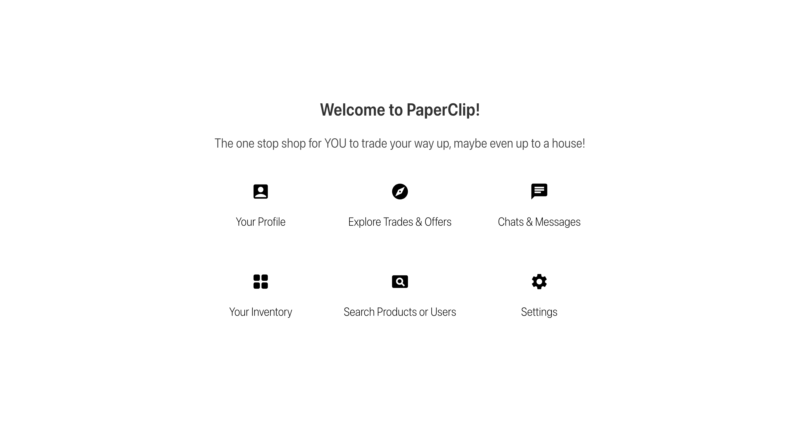
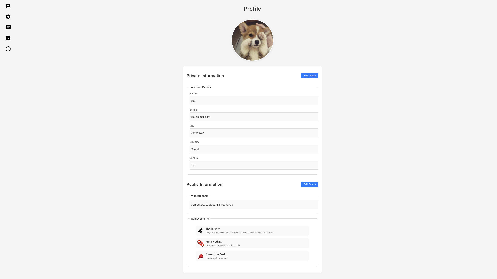
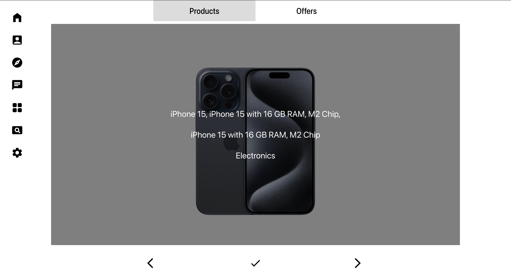
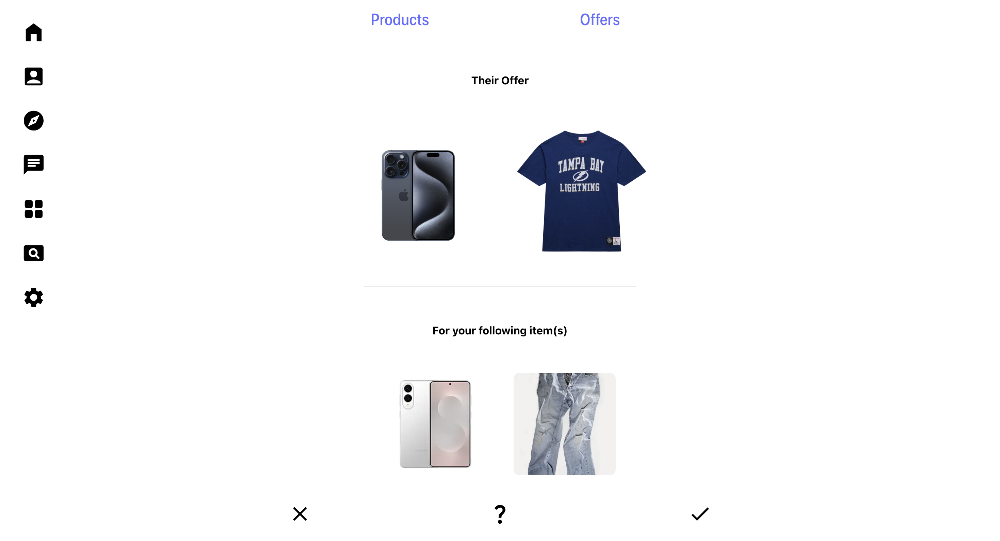
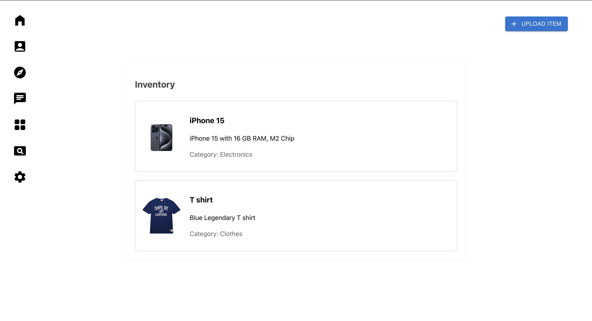
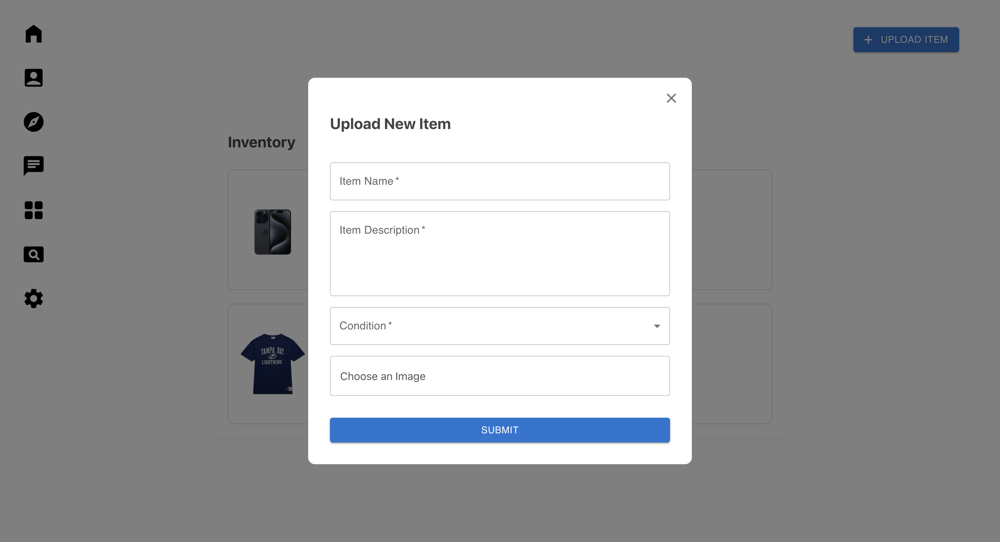
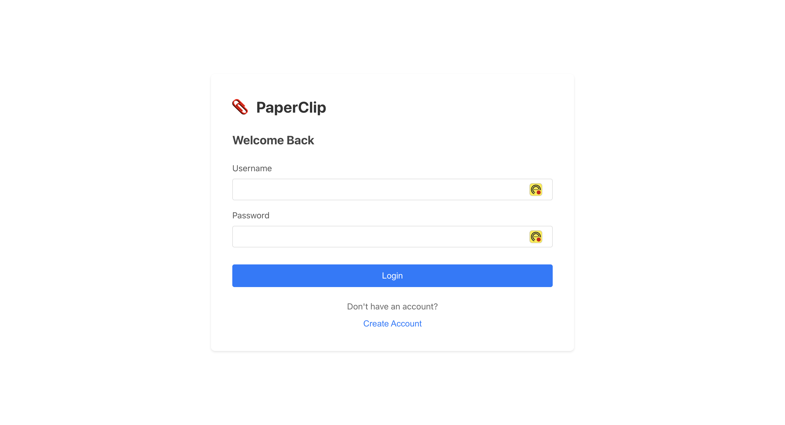
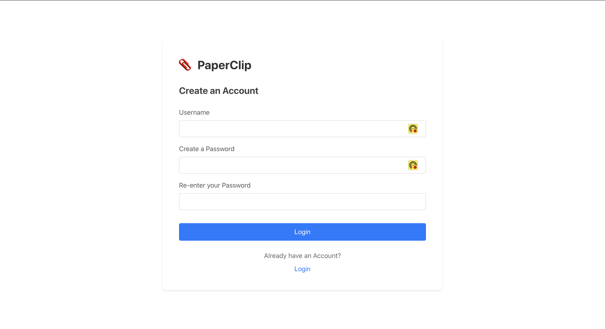
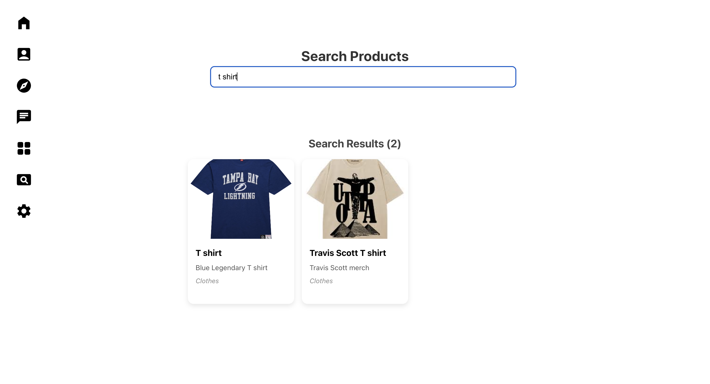

# PaperClip
Team Members:
- Arshdeep Jaggo
- Gagenvir Gill
- Matthew Fan
- Preston Lai

## Project Description
Our app is called PaperClip, it is a trading web-app inspired by the story of someone who traded a paperclip into a house. Our app is for people who have items sitting at home that they don’t want, and want to see if it’ll have value to someone else in exchange for other items rather than money.

This app will help people trade items with each other in a fast and simple way, making it easier to find trades for items that users (might) want, in addition to the app game-ifying the process with features that encourage the continuous ‘trading up’ of items. 

## Milestone 1

1. Wire Frames that we Implemented

- Home Page


- Profile Page


- Products Page


- Offers Page


- Inventory Page


- Upload Item Form


- Login/Sign-up Page



- Search Product Page


2. How we made progress towards some of our minimal goals

- "User's can create accounts and login logout" -> Got pages for logging in and creating account
- "Users can scroll through a smooth UI to browse other users’ items" -> Got a products page where users can scroll through items
- "Users can send, accept, reject, and negotiate" -> There is front end functionality for a user being able to accept an offer
- "Users can chat/message other users once they’ve accepted a trade" -> Implemented a chat front end button 

## Project Setup and Running Instructions

### Client Setup

To run the client application, follow these steps:

1. Go to client directory:
```bash
cd client
```

2. Build the docker image:

```bash
docker build -t client .
```

3. Start the development server:

```bash
docker run -p 4173:4173 client 
```

4. The application should now be running on your local development server.
http://localhost:4173/

To run the backend server, follow these steps:

1. Go to server directory:
```bash
cd server
```

2. Build the docker image:

```bash
docker build -t server .
```

3. Start the development server:

```bash
docker run -p 3000:3000 server
```