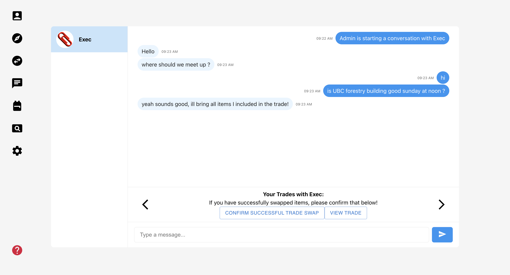
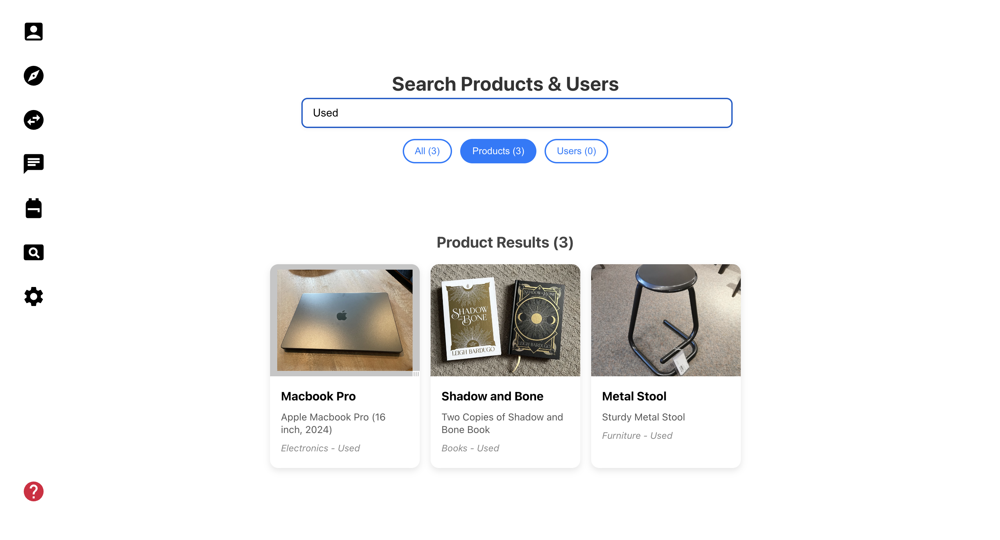
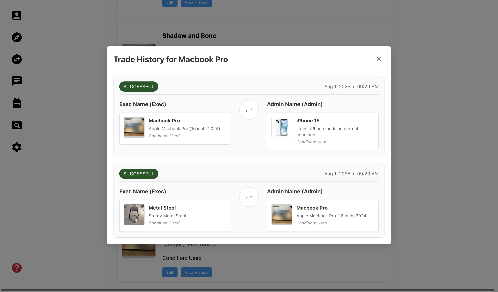
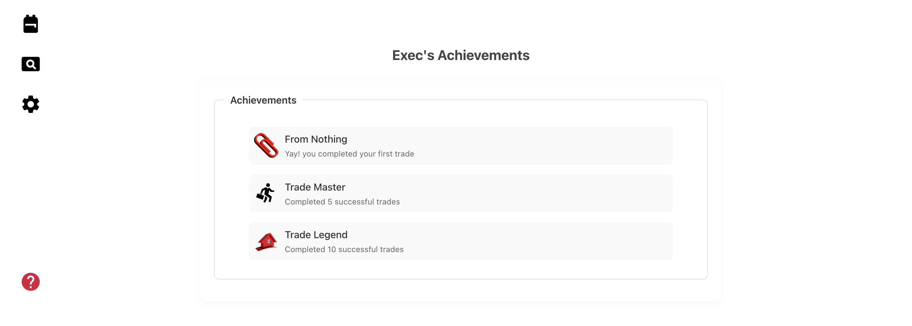
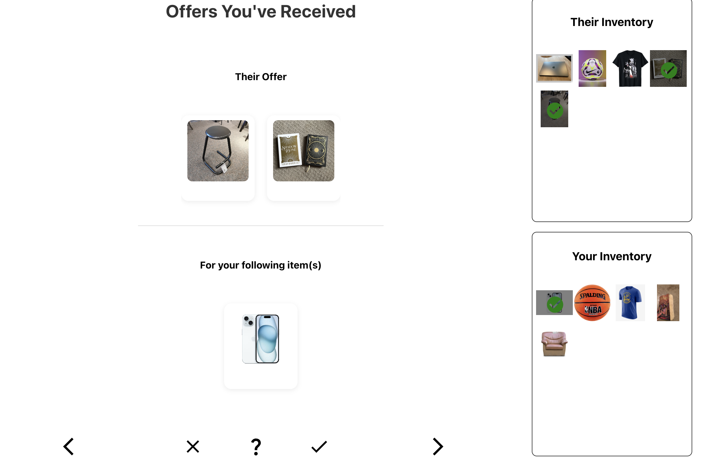
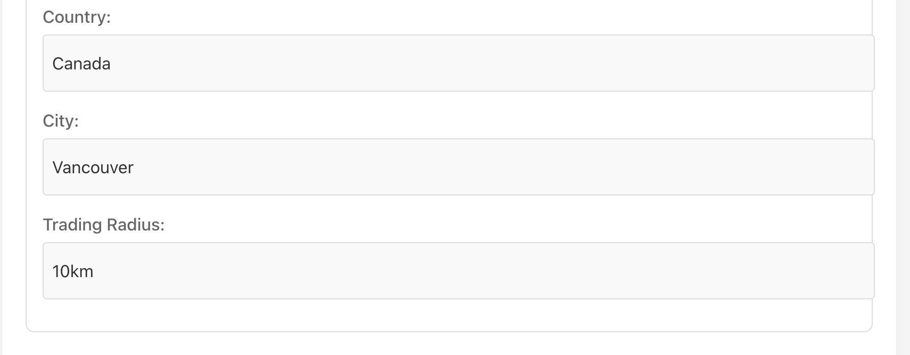

# PaperClip
Team Members:
- Arshdeep Jaggo
- Gagenvir Gill
- Matthew Fan
- Preston Lai

## Project Description
Our app is called PaperClip, it is a trading web-app inspired by the story of someone who traded a paperclip into a house. Our app is for people who have items sitting at home that they don't want, and want to see if it'll have value to someone else in exchange for other items rather than money.

This app will help people trade items with each other in a fast and simple way, making it easier to find trades for items that users (might) want, in addition to the app game-ifying the process with features that encourage the continuous 'trading up' of items.

## Milestone 1

1. Wire Frames that we Implemented

- Home Page


- Profile Page


- Products Page


- Offers Page


- Inventory Page


- Upload Item Form


- Login/Sign-up Page


- Search Product Page


2. How we made progress towards some of our minimal goals

- "User's can create accounts and login logout" -> Got pages for logging in and creating account
- "Users can scroll through a smooth UI to browse other users' items" -> Got a products page where users can scroll through items
- "Users can send, accept, reject, and negotiate" -> There is front end functionality for a user being able to accept an offer
- "Users can chat/message other users once they've accepted a trade" -> Implemented a chat front end button

## Project Setup and Running Instructions

### Client Setup

To run the client application, follow these steps:

1. Go to client directory:
```bash
cd client
```

2. Build the docker image:

```bash
docker build -t client .
```

3. Start the development server:

```bash
docker run -p 4173:4173 client
```

4. The application should now be running on your local development server.
http://localhost:4173/

## Milestone 1

To run the backend server, follow these steps:

1. Go to server directory:
```bash
cd server
```

2. Build the docker image:

```bash
docker build -t server .
```

3. Start the development server:

```bash
docker run -p 3000:3000 server
```

OR

You can run
```bash
npm run dev
```

## Milestone 2

Running application: `docker-compose up --build`
Running application with only server and client logs: `docker-compose up --build -d && docker-compose logs -f server client`

## Milestone 3:

Running the application: `docker compose up --build` or `docker-compose up --build`

The app runs on http://localhost:5173/

### Some Important Things to Know when using this application
- If you create a new account please go to the profile page and set a user preference before doing anything else as this is required for this Milestone
- Otherwise you can login with the preset accounts (username: Admin, password: password) (username: Exec, password: password)

### Changes since Milestone 2

All data is pulled from the backend (products page, offers page, search page, profile page, inventory page).

Milestone 3 fully implements our app's core functionality: trading items between users.
- Users can create a trade for a product using the items in their inventory in the products page
- Users can see trade offers and either reject or accept the trade offer in the offers page
- Users can view the trades they have created in the inventory page

We have also implemented a search functionality for our app, allowing users to:
- Search for items they would like to trade for and click on it to visit the products page with that item
	- The search can query for:
		- item name
		- item description
		- item category
		- item condition
		- owner of the item
- Search for users and see their inventory of items

Additionally, we have created a recommendation model powered by machine learning show users products they are interested in.

### Recommendation Model

Utilizing Sci-kit Learn we implemented a K Nearest Neighbours machine learning model. The model is trained on all the existing products in our applications MongoDB database. It obtains the data by making a request to the main backend server to get all products. The model is specifically training on 4 features of products, its name, description, category, and condition. The model combines these 4 text based fields for each product, and uses Spacy with the en_core_web_md model to embed the text string as a vector for the model to use.

To make a recommendation for a user, it takes in the user's preferences. Their preferences are made up of an array of 2 strings that are combined as inputs for using th emodel, one being a category name and the other being a description for that category. The preferences being an array allows for users to have multiple preferences, under multiple categories. The model then runs on each of these preferences and returns values for each product that represent how similar the products string is compared to the input string. This process is done for each preference. The model API then returns an array of product IDs in order of how likely the user wants to see the product (for multiple preferences, it takes the highest similarity value for ordering).

The model is accessed through a seperate API server using Python (because Sci-kit Learn is Python based) and the FastAPI framework.

Whenever a product is added removed or updated by a user, the model retrains itself so it can make recommendations based on the most recent information about the products. It does this through the main backend server making a request to the models API server, specifically the refresh endpoint which re-gets, and retrains the KNN model.

### Test Suite

To run the backend unit tests and view the results:

#### Running the Tests

**With Docker Compose:**
```bash
docker-compose up --build
docker-compose exec server npm test
```

**Or, if you have Node.js installed locally:**
```bash
cd server
npm install
npm test or npm run test
```

### Viewing the Test Results

After running the tests, an HTML report will be generated at:

```
server/mochawesome-report/mochawesome.html
```

Open this file in your web browser to see a summary of all passing and failing tests, with details for each test case.

## Milestone 4:

Running the application: `docker compose up --build` or `docker-compose up --build`

The app runs on http://localhost:5173/

### Some Important Things to Know when using this application
-  You can login with the preset accounts (username: Admin, password: password) (username: Exec, password: password) or create your own account

### App Summary

PaperClip is a modern web-based trading platform inspired by the viral story of trading a paperclip for a house. Our app enables users to discover, trade, and negotiate items with other users through an intuitive interface, eliminating the need for monetary transactions. What sets PaperClip apart is its gamified approach to trading with features like item recommendations powered by machine learning, real-time messaging between traders, and a comprehensive search system that helps users find their next perfect trade.

### Bug List
Our bug list is located in the github issues for our team repo

### Standard Goals

- Users can view their own and other users’ profile, that includes their inventory, with the option to make a trade directly through the profile page (rather than the main scrolling page with recommendations) [DONE]

- Users can see an in-depth history of an item (what it has been traded for and by who, creating a line graph of the item's trade history) [DONE]

- Users can participate in multi-party trades. For example: Jack has item A and wants item B, Tim has item B and wants item C, Bob has item C and wants item A. With a multi-party trade, the 3 of them would be able to form a ‘trade circle’. [DROPPED]

- Users can view all your trades with a specific user through the chat with them. Can also confirm a successful swap of items with the user as apart of the trade negotiation. [DONE]

- Users can modify their personal data such as geolocation/preferences and get updated reccomendations given their profile updates [DONE]

### Stretch Goals

- Users can earn achievements/badges within the application to display on their profile (to encourage continual trading) for completing activities like completing a line of trades that's 5 and 10 trades long. [NOT - STARTED]

- Utilizing a pre-built computer vision-esque model to obtain more information about user-added items (to take the provided image, along with its likely short description, to obtain more details for recommendations) [DROPPED]

- Users can search specifically for items (like they would on Google for example), requiring a search engine implementation that outputs items that match or closely match the users search query [DROPPED]


### Non-Trivial Elements 

- Machine Learning Reccomendation System: KNN model using Sci-kit Learn with text embedding via Spacy, automatically retrains when products change. Present as it's own service that is orchestrated with docker-compose

- Real-time Messaging System: Chat functionality between users after trade acceptance with real-time updates. You can easily view all trades with a specific user within your chat history and confirm when a swap has been successfully completed.

- Trade Negotiation System: Full trade lifecycle: create, accept, reject, negotiate with state management

- User Preference System: User-defined preferences that feed into ML recommendations

- Advanced Search: Multi-field AND-SEARCH that where you can search items/users and instantly trade with them. Sanitization across all queries

- Session Management: Secure login/logout with session persistence and user state management

- Trade History: Tracking of item trade history records

### XSS Security Assessment

#### These are the payloads that were used for each field:
1. `<script>alert('XSS')</script>`
2. ``
3. `"><svg/onload=alert('XSS')>`
4. `';alert('XSS');//`
5. `<body onload=alert('XSS')>`
6. `<iframe src="javascript:alert('XSS')"></iframe>`
7. `<a href="javascript:alert('XSS')">Click me</a>`
8. `&lt;script&gt;alert('XSS')&lt;/script&gt; (to test for double-encoding issues)`
9. `<div style="background-image:url(javascript:alert('XSS'))">`

#### Results
| Input Point   | Field       | Payload                | Result (Executed/Not Executed)   | Notes              |
|---------------|-------------|------------------------|----------------------------------|--------------------|
| Login         | Username    | 1,2,3,4,5,6,7,8,9      | None Executed                    | Rendered as text   |
| Profile Edit  | Name        | 1,2,3,4,5,6,7,8,9      | None Executed                    | Rendered as text   |
| Upload Item   | Description | 1,2,3,4,5,6,7,8,9      | None Executed                    | Rendered as text   |
| Search        | Query       | 1,2,3,4,5,6,7,8,9      | None Executed                    | Rendered as text   |
| Chat          | Message     | 1,2,3,4,5,6,7,8,9      | None Executed                    | Rendered as text   |

#### Additional Tests - Search Page
- Inputs such as `.*` or `^.*$` or `(a+)+` are able to MATCH with ALL ITEMS/USERS and returns all users and items.
- If you return an incomplete regex such as `(a+` then it crashes the entire search page
- By adding a layer of query sanitization to the search logic, inputs like the ones described above do not impact the results returned or crashing the search page

### M4 Highlights
- Renegotiation flow
- Being able to chat with the user after accepting the trade
- Being able to chat with any user given the search page
- Being able to confirm trades within the chat window. Allows users to confirm a successful trade and then swap items in their inventory
- Being able to view all trades with another user and their status within the chat
- Profile picture implementation
- Implemented a settings page for privacy settings, deleting account, and change password
- Viewing trade history of specific items
- A bug fix that was implemented this milestone was related to user session management handling on both the server and client side, with those fixed, the application functions as expected and bug free when users are both logged in and not logged in. Another bug that was fixed was updating the recommendation model to still function and give a generic order when a user had no preferences for it to recommend on.
- Many other small bug fixes, manual testing, automated testing, etc.

## Milestone 5:

### Demo

#### Intelligent ML-Powered Recommendations
- The application utilizes a KNN-based recommendation model to display products to users. It considers various product features and compares them to user preferences to generate recommendations. The model also updates itself when items are created, updated, or deleted, ensuring that the recommendations remain up to date.

#### Live Socket-based User Messaging
- Seamless WebSocket-powered chat system enables instant communication between traders. Users can negotiate deals, discuss item conditions, and coordinate meetups in real-time. Messaging becomes available immediately after trade acceptance or when users initiate conversations through search.



#### AND-based Search Functionality for Users and/or Products
- Comprehensive search functionality allows users to find both items and other traders using AND-based filtering. Search across categories, conditions, locations, and user profiles with automatic query sanitization for security.



#### Gamified Trading Experience
- Item History Tracking: Trace the complete journey of items, including previous owners and trade history. Special indicators for celebrity-owned items add prestige to trading.



- Achievement System: Earn badges and rewards for trading milestones, successful deals, and community engagement.



#### Smart Trade Management
- Renegotiation Tools: Modify existing offers with real-time counter-proposals and item substitutions.



- Inventory Management: Organize items with categories, conditions, and detailed descriptions. Upload multiple images per item.


#### Location-Based Trading
- Find traders within your preferred radius using geolocation services. Set custom trading distances and discover local trading opportunities.



### Application Requirements 

### Minimal Goals

- Users can create accounts, log in/out, and manage their inventory of items (CRUD) [DONE]

- Users can scroll through a smooth UI to browse other users’ items, which utilizes a custom ML recommendation model [DONE]

- Users can send, accept, reject, and negotiate (with any/all of the items in either parties inventory) trade offers with other users [DONE]

- Users can chat/message other users once they’ve accepted a trade, in order to arrange a meetup [DONE]

### Standard Goals

- Users can view their own and other users’ profile, that includes their inventory, with the option to make a trade directly through the profile page (rather than the main scrolling page with recommendations) [DONE]

- Users can see an in-depth history of an item (what it has been traded for and by who, creating a line graph of the item's trade history) [DONE]

- Users can participate in multi-party trades. For example: Jack has item A and wants item B, Tim has item B and wants item C, Bob has item C and wants item A. With a multi-party trade, the 3 of them would be able to form a ‘trade circle’. [DROPPED - Discussed with TA (Daichi)]

- Users can view all your trades with a specific user through the chat with them. Can also confirm a successful swap of items with the user as apart of the trade negotiation. [DONE]

- Users can modify their personal data such as geolocation/preferences and get updated reccomendations given their profile updates [DONE]

### Stretch Goals

- Users can earn achievements/badges within the application to display on their profile (to encourage continual trading) for completing activities like completing a line of trades that's 5 and 10 trades long. [DONE]

- Utilizing a pre-built computer vision-esque model to obtain more information about user-added items (to take the provided image, along with its likely short description, to obtain more details for recommendations) [DROPPED]

- Users can search specifically for items (like they would on Google for example), requiring a search engine implementation that outputs items that match or closely match the users search query [DROPPED]

### Non-Trivial Elements 

- Machine Learning Reccomendation System: KNN model using Sci-kit Learn with text embedding via Spacy, automatically retrains when products change. Present as it's own service that is orchestrated with docker-compose

- Real-time Messaging System: Chat functionality between users after trade acceptance with real-time updates. You can easily view all trades with a specific user within your chat history and confirm when a swap has been successfully completed.

- Trade Negotiation System: Full trade lifecycle: create, accept, reject, negotiate with state management

- User Preference System: User-defined preferences that feed into ML recommendations

- Advanced Search: Multi-field AND-SEARCH that where you can search items/users and instantly trade with them. Sanitization across all queries

- Session Management: Secure login/logout with session persistence and user state management

- Trade History: Tracking of item trade history records

### Bug List

- All bugs are referenced in our [github issues](https://github.students.cs.ubc.ca/CPSC455-2025S/team28/issues)
- All P1/P0 bugs are complete
- All P2/P3 bugs are resolved or marked as “won’t fix” with a reason
- Any other bugs are resolved or documented with notes for why they won’t be fixed for this release

### M5 highlights

- UX fixes
- Bug fixes
- Help button pop ups
- User achievements
- User achievements visible through user search
- Switching from JS alerts to toasts
- Default message when you start a conversation with a user for the first time
- Logout feature
- Update reccomender to cache as much as possible (more efficient)
- Split Products/Offers page into two separate pages
- Add filters to search page
- Add details to offers page (can click each item to see details/history)
- Remove home page
- Updated behaviour when there are no products present in your trading radius