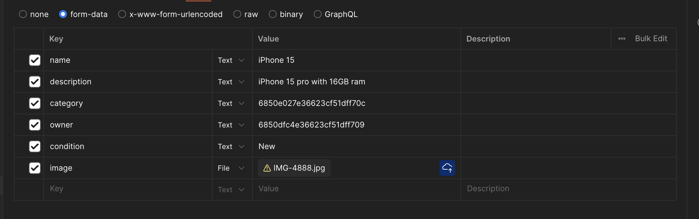
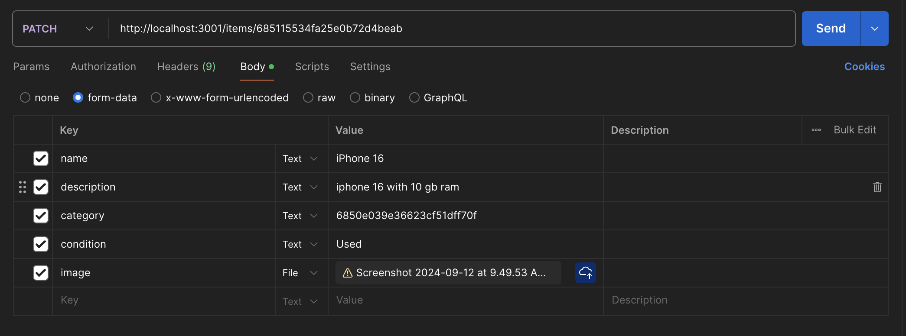

# List of End points that have been created so far

-   GET http://localhost:3001/test
    For testing server connection

## USERS

-   POST http://localhost:3001/users

```bash
Example Body
{
    "username": "Arshdeep_is_Awesome",
	"name": "Arshdeep",
    "password": "password123",
    "city": "Vancouver",
	"country": "Canada"
}

Example of what gets returned
{
    "_id": "68510d80587ba5eebf9c2e0d",
    "username": "Sony123",
	"name": "Sony",
    "city": "Vancouver",
	"country": "Canada",
    "tradingRadius": 10,
    "inventory": [],
    "createdAt": "2025-06-17T06:38:56.679Z"
}
```

-   GET http://localhost:3001/users/:id

```bash
Example of what gets returned

{
    "_id": "6850dfc4e36623cf51dff709",
    "username": "Simar",
    "location": "Vancouver",
    "tradingRadius": 10,
    "inventory": [],
    "createdAt": "2025-06-17T03:23:48.644Z",
    "updatedAt": "2025-06-17T06:37:36.908Z",
    "__v": 18
}

or

{
    "_id": "6850dfc4e36623cf51dff709",
    "username": "Simar",
    "location": "Vancouver",
    "tradingRadius": 10,
    "inventory": [
        {
            "_id": "68510eb2587ba5eebf9c2e11",
            "name": "iPhone 15",
            "description": "iPhone 15 pro with 16GB ram",
            "category": "6850e027e36623cf51dff70c",
            "owner": "6850dfc4e36623cf51dff709",
            "condition": "New",
            "imagePath": "./public/1750142642494-55253357.jpg",
            "createdAt": "2025-06-17T06:44:02.532Z",
            "updatedAt": "2025-06-17T06:44:02.532Z",
            "__v": 0
        }
    ],
    "createdAt": "2025-06-17T03:23:48.644Z",
    "updatedAt": "2025-06-17T06:44:02.534Z",
    "__v": 19
}
```

## CATEGORIES

-   POST http://localhost:3001/categories

```bash
Example Body
{
    "name": "Technology"
}

Example of what gets returned

{
    "name": "Technology",
    "_id": "6850e039e36623cf51dff70f",
    "createdAt": "2025-06-17T03:25:45.571Z",
    "updatedAt": "2025-06-17T03:25:45.571Z",
    "__v": 0
}
```

-   GET http://localhost:3001/categories

```bash
Example of what gets returned

[
    {
        "_id": "6850e027e36623cf51dff70c",
        "name": "Clothes",
        "createdAt": "2025-06-17T03:25:27.243Z",
        "updatedAt": "2025-06-17T03:25:27.243Z",
        "__v": 0
    },
    {
        "_id": "6850e039e36623cf51dff70f",
        "name": "Technology",
        "createdAt": "2025-06-17T03:25:45.571Z",
        "updatedAt": "2025-06-17T03:25:45.571Z",
        "__v": 0
    }
]
```

## ITEMS

-   POST http://localhost:3001/items

Example body - Use formData on postman so you can attach files


```bash
Example of what gets returned

{
    "name": "iPhone 15",
    "description": "iPhone 15 pro with 16GB ram",
    "category": "6850e027e36623cf51dff70c",
    "owner": "6850dfc4e36623cf51dff709",
    "condition": "New",
    "imagePath": "./public/1750142256850-324907369.jpg",
    "_id": "68510d30587ba5eebf9c2e03",
    "createdAt": "2025-06-17T06:37:36.900Z",
    "updatedAt": "2025-06-17T06:37:36.900Z",
    "__v": 0,
    "image": "data:image/jpeg;base64,/9j/4AAUSkZJRgABAQEBLAEsAABBTVBG/+EKrEV4aWYAAE1NACoAAAAIAA4BDwACAAAABgAAALYBEAACAAAADgAAALwBEgADAAAAAQABAAABGgAFAAAAAQAAAMoBGwAFAAAAAQAAANIBKAADAAAAAQACAAABMQACAAAABwAAANoBMgACAAAAFAAAAOIBPAACAAAADgAAAPYBQgAEAAAAAQAAAgABQwAEAAAAAQAAAgACEwADAAAAAQABAACHaQAEAAAAAQAAAQSIJQAEAAAAA..."
}
```

-   DELETE http://localhost:3001/items/:id

```bash
Example of what gets returned
{
    "message": "Item deleted successfully."
}
```

-   PATCH http://localhost:3001/items/:id

Example body - Use formData on postman so you can attach files


```bash
Example of what gets returned

{
    "_id": "685115534fa25e0b72d4beab",
    "name": "iPhone 16",
    "description": "iphone 16 with 10 gb ram",
    "category": "6850e039e36623cf51dff70f",
    "owner": "6850dfc4e36623cf51dff709",
    "condition": "Used",
    "imagePath": "./public/1750144767004-243491146.png",
    "createdAt": "2025-06-17T07:12:19.767Z",
    "updatedAt": "2025-06-17T07:19:27.033Z",
    "__v": 0,
    "image": "data:image/jpeg;base64,iVBORw0KGgoAAAANSUhEUgAAATIAAAEeCAYAAAAJqJmIAAAMPmlDQ1BJQ0MgUHJvZmlsZQAASImVVwdYU8kWnluSkEBCCV1K6E2KSAkgJYQWQHoRbIQkQCghBo..."
}
```

NEED TO BE ADDED

-   For User db schema
    GET http://localhost:3001/users

GET/DELETE/PATCH http://localhost:3001/users/:id

-   For Item db schema
    GET/POST http://localhost:3001/items

GET/DELETE/PATCH http://localhost:3001/items/:id

-   For Trades db schema
    GET/POST http://localhost:3001/trades

GET/DELETE/PATCH http://localhost:3001/items/:id
